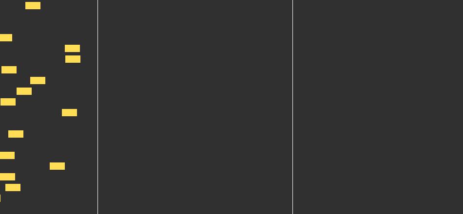

# cars-counter-simulator

A Proof Of Concept for testing a car speed radar from human two observation points

Can determine a speed of segment stream and bandwidth

```
# Init python environment
python3 -m venv .virtualenv
source .virtualenv/bin/activate
pip install Pillow

# Run simulator
python simulate.py && convert -delay 8 -loop 0 image*.png animated.gif
```

**Simulation result**


